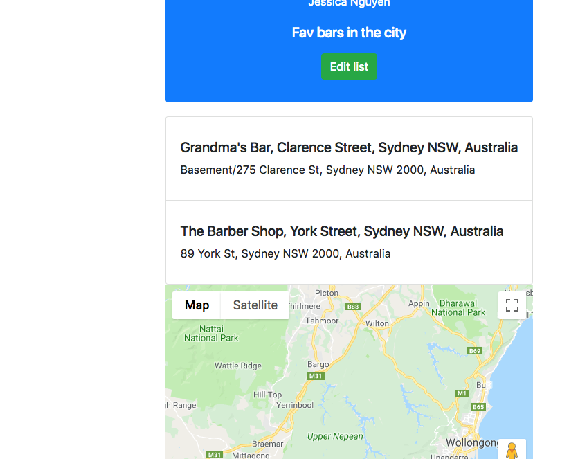
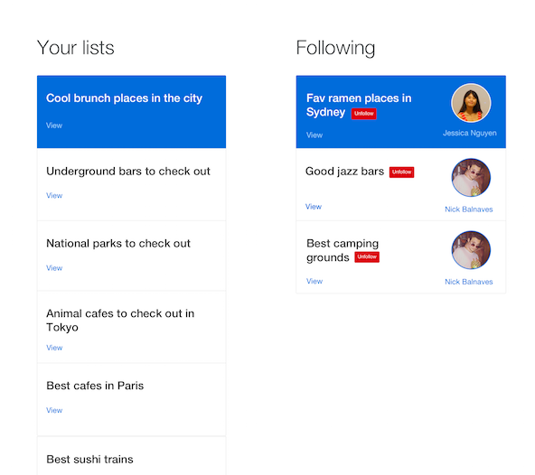

# Introduction

Localists is a list web app running on React with a Firebase backend. Use Localists to create and share lists of your favourite places with your friends.

## List

## Dashboard view

## Installation
npm i

## Run
npm start
